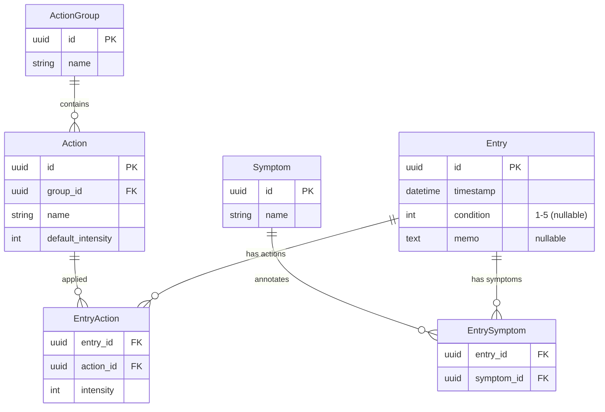

# Self-Track v2 — 要件・技術仕様 提案書 (Rev.6)

## 1. コンセプト

日々の行動と体調を記録し、**相関分析によって最適な習慣の組み合わせを発見する** 個人用アプリ。

---

## 2. データモデル（タグ分離モデル）

**「Action（行動）」と「Symptom（症状・状態）」は性質が違うため、明確に分離します。**
これにより、データ構造の矛盾がなくなり、UIも分析も極めてシンプルになります。

### 2-1. Action（自分で行ったこと / 原因）

薬、サプリ、運動など。**「強度（intensity）」と「グループ」を持ちます。**

| テーブル | フィールド | 説明 |
|---|---|---|
| **ActionGroup** | `id`, `name`, `color`, `sort_order` | "サプリ", "薬", "運動" など |
| **Action** | `id`, `group_id`(FK), `name`, `default_intensity`, `sort_order` | "ビタミンD", "ランニング" など |

### 2-2. Symptom（起きたこと / コンディションの注釈）

頭痛、快眠、集中力など。**コンディションスコア（1-5）の理由付け（注釈）** であるため、強度の概念やグループは不要です。フラットなリストとして管理します。

| テーブル | フィールド | 説明 |
|---|---|---|
| **Symptom** | `id`, `name`, `color`, `sort_order` | "頭痛", "ブレインフォグ", "快便" など |

---

### 2-3. 統一エントリー（日々の記録）

コンディション、Symptom、Action、メモをまとめる器（ツイート）です。

| テーブル | フィールド | 説明 |
|---|---|---|
| **Entry** | `id`, `timestamp`, `condition`(1-5), `memo` | |
| **EntryAction**| `entry_id`(FK), `action_id`(FK), `intensity` | エントリーに紐づくAction（複数可） |
| **EntrySymptom**| `entry_id`(FK), `symptom_id`(FK) | エントリーに紐づくSymptom（複数可） |

---

### ER図

---

## 3. この分離モデルのメリット

1. **矛盾の完全排除**:
   「サプリグループに頭痛が入る」「頭痛のintensityを2にする」といった運用上のバグが構造的に起こり得なくなります。
2. **UIがより直感的に**:
   ホーム画面の入力UIを「💊 Actionを追加（服薬・運動など）」と「🤕 Symptomを追加（今の状態の注釈）」で明確に分けられます。ユーザーのメンタルモデルに完全に一致します。
3. **分析エンジンのシンプル化**:
   分析エンジンは `Action` を「独立変数（原因）」、`condition` と `Symptom` を「従属変数（結果）」として脳死で計算するだけでよくなります。roleの判定ロジック等が不要になります。

---

## 4. コンディション・スコアリング（変更なし）

- スプライン補間による滑らかな曲線
- 24時間入力なしで `3` を自動挿入
- 曲線下面積の積分による日次スコア算出

---

## 5. 技術スタック（変更なし）

Next.js (App Router) + Vercel Postgres + TypeScript (`simple-statistics`)

---

## 6. 結論

「ActionとSymptomを分離する」というご指摘は**大正解**だと思います。
少しテーブル数は増えますが、ドメイン駆動設計（DDD）的な観点からも、現実世界のモデリングとして非常に美しく、後々の負債を防ぐ堅牢なアーキテクチャになります。

この Rev.6 で要件・仕様のベースとしては **完成** に近いと考えますが、いかがでしょうか？
