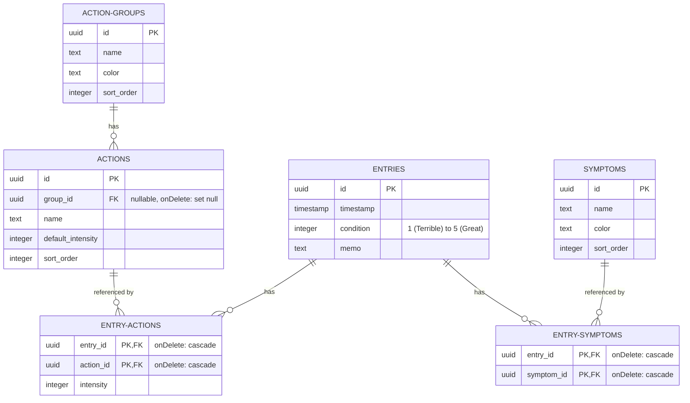

# Database Schema & Data Model Specification

This document details the database layout, relationships, and data modeling constraints for the Self-Track v2 project. Drizzle ORM is used to define these PostgreSQL schemas in [schema.ts](file:///Users/tau/repo/dev/self-track-v2/src/db/schema.ts).

---

## 📊 Entity-Relationship Diagram (ERD)

The relational schema maps condition logs, custom actions, and symptoms. Junction tables coordinate many-to-many relationships and are set to automatically cascade deletion to avoid orphan records.

---

## 🗄️ Tables and Fields

### 1. `entries` (Condition Logs)
Represents a unified log entry (similar to a micro-post/tweet). This is the core recording unit.
- **`id`** (`uuid`, Primary Key): Generated randomly.
- **`timestamp`** (`timestamp with time zone`): Record creation time, defaulting to the JST-equivalent current time.
- **`condition`** (`integer`, Nullable): The user's felt condition rating from 1 to 5.
- **`memo`** (`text`, Nullable): Optional text notes for the entry.
- **Constraints**:
  - `condition_range`: Validates that `condition` is either `NULL` or an integer between `1` and `5` inclusive.

### 2. `actions` (Habits/Supplements)
Activities, medications, workouts, or supplements that the user tracks.
- **`id`** (`uuid`, Primary Key)
- **`name`** (`text`, Required)
- **`defaultIntensity`** (`integer`): Default numeric value logged (e.g. tablet count or hours) when this action is clicked. Defaults to `1`.
- **`sortOrder`** (`integer`): Ordering index in custom dashboards.
- **`groupId`** (`uuid`, Foreign Key): References `action_groups.id` with `onDelete: "set null"`.

### 3. `action_groups`
Categories used to group actions (e.g., "💊 Medications", "🏃 Workouts").
- **`id`** (`uuid`, Primary Key)
- **`name`** (`text`, Required)
- **`color`** (`text`, Nullable): Hex code theme representation.
- **`sortOrder`** (`integer`)

### 4. `symptoms`
Observed physical states or annotations (e.g., "Headache", "Fatigue") to track alongside condition scores.
- **`id`** (`uuid`, Primary Key)
- **`name`** (`text`, Required)
- **`color`** (`text`, Nullable)
- **`sortOrder`** (`integer`)

### 5. `entry_actions` (Junction Table)
Coordinates the many-to-many relationship between `entries` and `actions`, adding an `intensity` value for the specific event.
- **`entryId`** (`uuid`, FK): References `entries.id` with `onDelete: "cascade"`.
- **`actionId`** (`uuid`, FK): References `actions.id` with `onDelete: "cascade"`.
- **`intensity`** (`integer`): The logged quantity of the action for this specific entry.
- **Primary Key**: Compound key `(entryId, actionId)`.

### 6. `entry_symptoms` (Junction Table)
Coordinates the many-to-many relationship between `entries` and `symptoms`.
- **`entryId`** (`uuid`, FK): References `entries.id` with `onDelete: "cascade"`.
- **`symptomId`** (`uuid`, FK): References `symptoms.id` with `onDelete: "cascade"`.
- **Primary Key**: Compound key `(entryId, symptomId)`.
