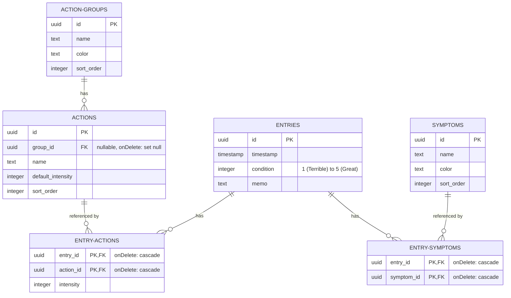

# データベーススキーマ＆データモデル仕様書

このドキュメントでは、Self-Track v2 プロジェクトにおけるデータベース設計、リレーションシップ、およびデータモデリングの制約について詳しく説明します。Drizzle ORM を使用して、これらの PostgreSQL スキーマを [schema.ts](file:///Users/tau/repo/dev/self-track-v2/src/db/schema.ts) で定義しています。

---

## 📊 エンティティ・リレーションシップ図 (ERD)

リレーショナルスキーマは、体調ログ、カスタムアクション、および症状をマッピングします。中間テーブル（Junction Tables）は多対多の関係を調整し、孤立レコードの発生を防ぐために削除時には自動的にカスケード削除されるように設定されています。

---

## 🗄️ テーブルとフィールドの詳細

### 1. `entries` (体調ログ)
統合されたログエントリー（マイクロポスト/ツイート形式）を表します。これが記録の基本単位となります。
- **`id`** (`uuid`, 主キー): ランダムに生成されます。
- **`timestamp`** (`timestamp with time zone`): レコード作成日時。デフォルトは JST（日本標準時）相当の現在時刻です。
- **`condition`** (`integer`, Nullable): 1から5段階で表される、ユーザーが感じた体調評価。
- **`memo`** (`text`, Nullable): エントリーに対する任意のメモ書き。
- **制約事項**:
  - `condition_range`: `condition` の値が `NULL` または `1` から `5` までの整数であることをバリデーションします。

### 2. `actions` (習慣/サプリメントなど)
ユーザーが追跡する活動、薬、ワークアウト、またはサプリメントを表します。
- **`id`** (`uuid`, 主キー)
- **`name`** (`text`, 必須)
- **`defaultIntensity`** (`integer`): アクションがクリックされたときにデフォルトで記録される数値（例：錠剤の数、または時間など）。デフォルト値は `1` です。
- **`sortOrder`** (`integer`): カスタムダッシュボード等での並び順インデックス。
- **`groupId`** (`uuid`, 外部キー): `action_groups.id` を参照。`onDelete: "set null"`（グループ削除時はNULL化）に設定されています。

### 3. `action_groups`
アクションをグループ化するためのカテゴリ（例：「💊 薬/サプリ」「🏃 運動」など）。
- **`id`** (`uuid`, 主キー)
- **`name`** (`text`, 必須)
- **`color`** (`text`, Nullable): カラーテーマを表す HEX カラーコード。
- **`sortOrder`** (`integer`): 並び順インデックス。

### 4. `symptoms` (症状・状態の注釈)
体調スコアとともに記録される、観察された身体状態や注釈（例：「頭痛」「疲労感」など）。
- **`id`** (`uuid`, 主キー)
- **`name`** (`text`, 必須)
- **`color`** (`text`, Nullable)
- **`sortOrder`** (`integer`)

### 5. `entry_actions` (中間テーブル)
`entries` と `actions` の間の多対多の関係を管理し、特定のエントリーにおけるアクションの「強度（intensity）」の値を保持します。
- **`entryId`** (`uuid`, 外部キー): `entries.id` を参照。`onDelete: "cascade"` に設定されています。
- **`actionId`** (`uuid`, 外部キー): `actions.id` を参照。`onDelete: "cascade"` に設定されています。
- **`intensity`** (`integer`): この特定のエントリーにおいて記録されたアクション of 量。
- **主キー**: 複合キー `(entryId, actionId)`。

### 6. `entry_symptoms` (中間テーブル)
`entries` と `symptoms` の間の多対多の関係を管理します。
- **`entryId`** (`uuid`, 外部キー): `entries.id` を参照。`onDelete: "cascade"` に設定されています。
- **`symptomId`** (`uuid`, 外部キー): `symptoms.id` を参照。`onDelete: "cascade"` に設定されています。
- **主キー**: 複合キー `(entryId, symptomId)`。
