# Self-Track v2 — 実装計画

---

## 1. 仕様の最終整合性チェック

Rev.6 の仕様を以下の観点で点検しました。

### ✅ 問題なし

| チェック項目 | 結果 |
|---|---|
| Action と Symptom の分離 | ✅ Action = 原因（独立変数）、Symptom = 結果の注釈（従属変数）。因果関係が構造で保証される |
| Action に intensity / group がある | ✅ 服薬量・運動強度の記録に必要。Symptom は不快さ=condition で表現されるため不要 |
| Entry の統一モデル | ✅ コンディション・Action・Symptom・メモを1つのエントリーにまとめられる |
| スプライン補間 + 24hルール | ✅ 曲線は自然に3へ回帰、継続入力のインセンティブが働く |
| 分析エンジン（TypeScript統一）| ✅ 個人データ規模なら `simple-statistics` で十分 |
| Vercel 完結 | ✅ Next.js + Vercel Postgres で全要件をカバー |

### ⚠️ 軽微な補足事項（実装で対応）

| # | 事項 | 対応方針 |
|---|---|---|
| 1 | **Entry の最低要件**: condition / action / symptom / memo のすべてが空のエントリーは無意味 | バリデーションで「少なくとも1つは必要」を強制 |
| 2 | **Action.group_id の nullable**: グループに属さない Action（例: 一回限りの行動）を許容するか | **nullable にする**（グループ未所属を許容） |
| 3 | **Symptom 単独エントリー**: Symptom は「condition の注釈」だが、condition なしで Symptom だけ記録することを許容するか | **許容する**（UX 優先。後から condition を含む別エントリーを追加すればよい） |
| 4 | **スプライン補間の境界**: 1日に condition 記録が1点のみの場合、前日の最終値（または3）と翌日の最初の値（または24h後の自動3）を補助点として使う | 実装時に前後のポイントを参照するロジックで対処 |
| 5 | **タイムゾーン**: Vercel Postgres は UTC 保存。「日」の境界は JST（UTC+9）で判定する必要がある | API/フロントの両方で JST 基準の日付計算を行う |

> [!NOTE]
> いずれも仕様レベルの矛盾ではなく、実装時の設計判断として解決できる事項です。
> **仕様に矛盾はありません。実装に進めます。**

---

## 2. 実装計画

### フェーズ概要

```mermaid
gantt
    title Self-Track v2 実装フェーズ
    dateFormat X
    axisFormat %s

    section Foundation
    P1 プロジェクト初期化     :p1, 0, 1
    P2 DB スキーマ            :p2, after p1, 1

    section Core API
    P3 CRUD API              :p3, after p2, 1

    section UI
    P4 ホーム画面            :p4, after p3, 2
    P5 カレンダー・履歴      :p5, after p4, 1

    section Analysis
    P6 分析エンジン・ダッシュボード :p6, after p5, 2

    section Polish
    P7 管理・設定・PWA       :p7, after p6, 1
```



---

### Phase 1: プロジェクト初期化

#### [NEW] Next.js プロジェクトセットアップ

```
self-track-v2/
├── src/
│   ├── app/              # App Router
│   │   ├── layout.tsx
│   │   ├── page.tsx       # ホーム
│   │   ├── calendar/
│   │   ├── analysis/
│   │   ├── manage/
│   │   ├── settings/
│   │   └── api/           # API Routes
│   ├── components/
│   ├── db/
│   │   ├── schema.ts      # Drizzle スキーマ定義
│   │   ├── index.ts       # DB 接続
│   │   └── migrate.ts
│   ├── lib/
│   │   ├── analysis/      # 分析エンジン
│   │   └── utils.ts
│   └── styles/
│       └── globals.css
├── drizzle.config.ts
├── next.config.ts
├── package.json
└── tsconfig.json
```

- Next.js (App Router) のセットアップ
- Drizzle ORM の設定
- Vercel Postgres (Neon) の接続設定
- PWA 基盤（`@serwist/next`）
- CSS 設計（グローバルスタイル、カラーパレット、ダークモード対応）

---

### Phase 2: DB スキーマ & マイグレーション

#### [NEW] `src/db/schema.ts`

Drizzle ORM で以下のテーブルを定義:

| テーブル | 主なカラム | 備考 |
|---|---|---|
| `action_groups` | id, name, color, sort_order | |
| `actions` | id, group_id (nullable FK), name, default_intensity, sort_order | |
| `symptoms` | id, name, color, sort_order | |
| `entries` | id, timestamp, condition (nullable, 1-5), memo (nullable) | check制約: condition, actions, symptoms, memo のいずれか1つ以上 |
| `entry_actions` | entry_id (FK), action_id (FK), intensity | 複合PK |
| `entry_symptoms` | entry_id (FK), symptom_id (FK) | 複合PK |

- `drizzle-kit` でマイグレーションファイル生成
- シードデータ（サンプルの ActionGroup / Action / Symptom）

---

### Phase 3: CRUD API Routes

#### [NEW] `src/app/api/`

| エンドポイント | メソッド | 概要 |
|---|---|---|
| `/api/entries` | GET, POST | エントリー一覧取得（ページネーション）、新規作成 |
| `/api/entries/[id]` | GET, PUT, DELETE | エントリー詳細・更新・削除 |
| `/api/actions` | GET, POST | Action 一覧・作成 |
| `/api/actions/[id]` | PUT, DELETE | Action 更新・削除 |
| `/api/action-groups` | GET, POST | ActionGroup 一覧・作成 |
| `/api/action-groups/[id]` | PUT, DELETE | ActionGroup 更新・削除 |
| `/api/symptoms` | GET, POST | Symptom 一覧・作成 |
| `/api/symptoms/[id]` | PUT, DELETE | Symptom 更新・削除 |

- 入力バリデーション（Zod）
- エラーハンドリング

---

### Phase 4: ホーム画面

メインの記録画面。**一人ツイートのTL** がコア。

#### [NEW] `src/app/page.tsx` + 関連コンポーネント

| コンポーネント | 概要 |
|---|---|
| `ConditionButtons` | 1〜5 のボタン。タップで即エントリー生成 |
| `EntryComposer` | ボタンタップ後に展開。Action選択・Symptom選択・コメント入力を追加可能 |
| `Timeline` | エントリーを時系列で表示（新しいものが上）。各エントリーにcondition・タグ・コメントを表示 |
| `ConditionCurve` | 今日のコンディション推移をスプライン曲線で表示（recharts） |

**UXフロー:**
1. ユーザーが 1〜5 のボタンをタップ → condition 付きエントリーが即座に作成される
2. タップ後、下部に Action/Symptom/メモ の追加UIが表示される（任意）
3. TL に新しいエントリーが追加される

---

### Phase 5: カレンダー・履歴

#### [NEW] `src/app/calendar/page.tsx`

| コンポーネント | 概要 |
|---|---|
| `MonthCalendar` | 月間カレンダー。各日のセルに日次スコアを色（グラデーション）で表現 |
| `DayDetail` | 日をタップすると、その日のエントリー一覧 + コンディション曲線を表示 |

---

### Phase 6: 分析エンジン & ダッシュボード

#### [NEW] `src/lib/analysis/`

| モジュール | 概要 |
|---|---|
| `dailyScore.ts` | スプライン補間、24hルール適用、日次スコア算出（積分） |
| `correlation.ts` | タグ影響ランキング（ポイントバイシリアル相関）、強度効果（スピアマン相関） |
| `combination.ts` | ベスト組み合わせ（頻出パターン + 平均比較） |
| `timeLag.ts` | タイムラグ分析（日ずらし相関） |
| `actionSymptom.ts` | Action → Symptom 抑制分析（φ係数） |

#### [NEW] `src/app/api/analysis/`

| エンドポイント | 概要 |
|---|---|
| `/api/analysis/ranking` | タグ影響ランキング |
| `/api/analysis/combination` | ベスト組み合わせ |
| `/api/analysis/timelag` | タイムラグ分析 |
| `/api/analysis/daily-scores` | 日次スコア一覧（カレンダー用） |

#### [NEW] `src/app/analysis/page.tsx`

| コンポーネント | 概要 |
|---|---|
| `CorrelationRanking` | Action → Condition スコアの相関ランキング表 |
| `TimeLagChart` | タイムラグ相関のグラフ |
| `BestCombination` | スコア上位日に共通するタグ組み合わせ |
| `SymptomSuppression` | Action → Symptom の抑制効果表 |

---

### Phase 7: 管理・設定・PWA 仕上げ

#### [NEW] `src/app/manage/page.tsx`

- Action / ActionGroup の CRUD UI
- Symptom の CRUD UI
- ドラッグ&ドロップで並び替え

#### [NEW] `src/app/settings/page.tsx`

- JSON エクスポート / インポート
- ダークモード / ライトモード切替

#### PWA 最終調整

- Service Worker 設定
- Web App Manifest（アイコン、テーマカラー）
- オフライン時のフォールバック画面

---

## 3. 検証計画

### 自動テスト

```bash
# ユニットテスト（分析エンジン）
npx vitest run src/lib/analysis/

# API 統合テスト
npx vitest run src/app/api/

# E2E テスト
npx playwright test
```

| テスト対象 | ツール | 範囲 |
|---|---|---|
| 分析ロジック | Vitest | スプライン補間、日次スコア計算、相関計算の正確性 |
| API Routes | Vitest | CRUD 操作、バリデーション、エラーハンドリング |
| UI フロー | Playwright | エントリー作成→TL表示、カレンダー表示、分析画面 |

### 手動検証

- ブラウザでの動作確認（レスポンシブ対応含む）
- Android Chrome での PWA インストール・動作確認
- Vercel へのデプロイ確認
